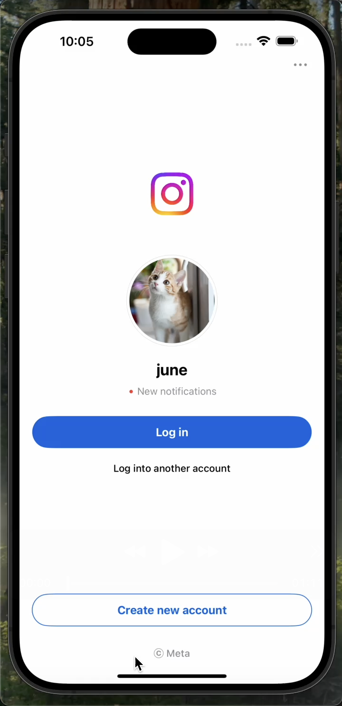
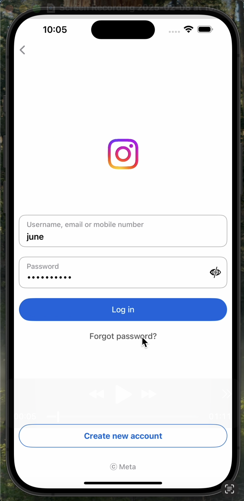
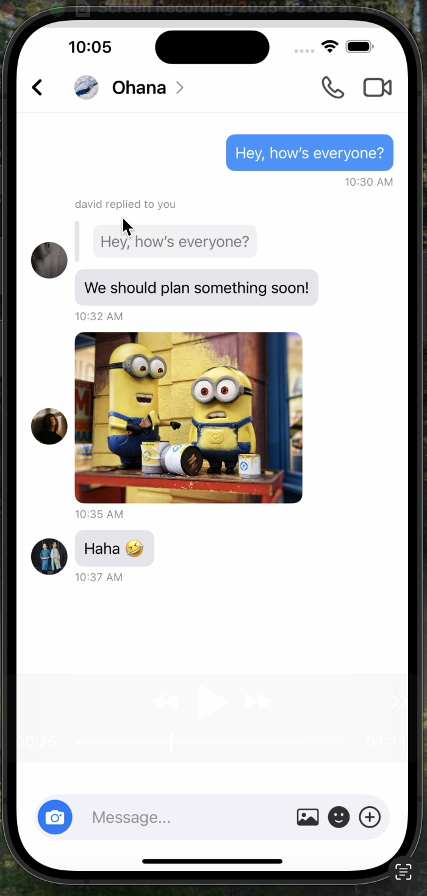
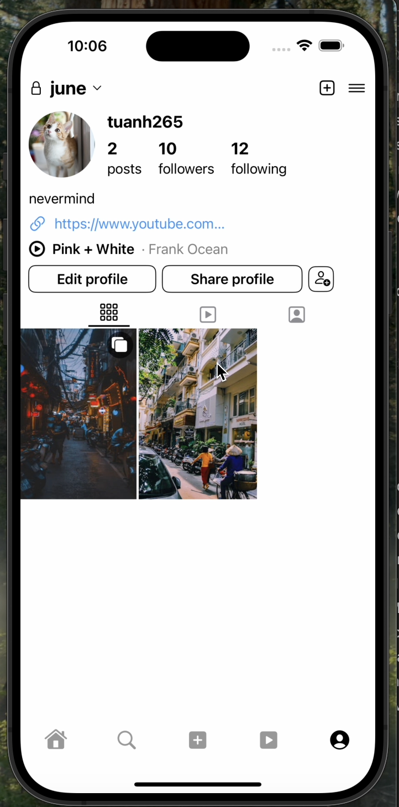
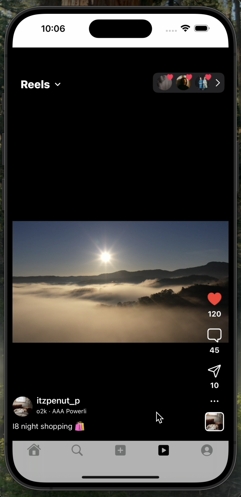
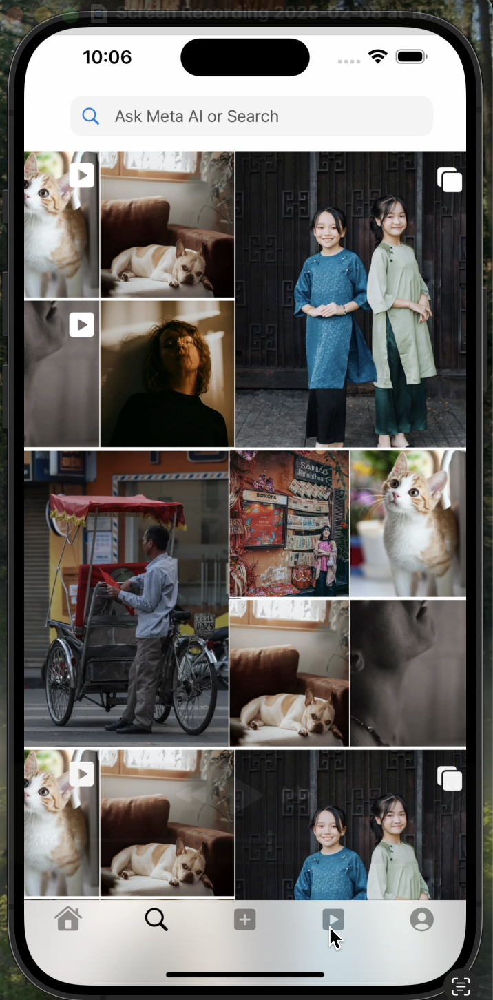
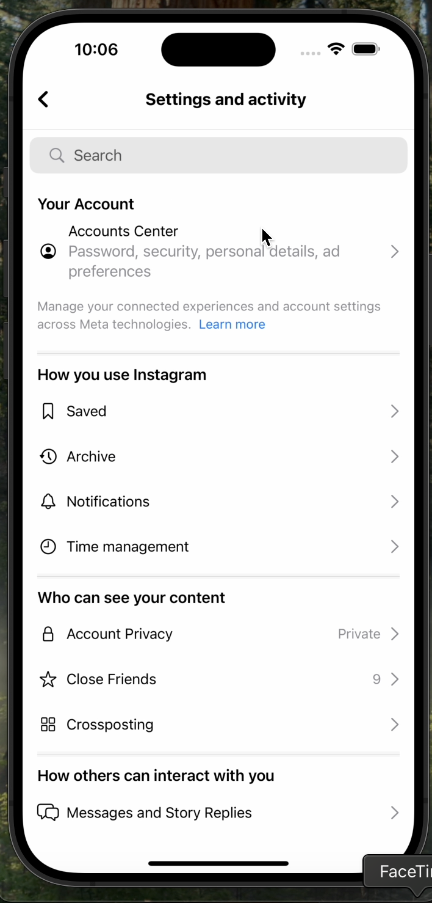

# SwiftUI Instagram Clone

A SwiftUI Instagram Clone that demonstrates UI cloning using sample data (pictures and videos). This project includes multiple screens such as Login, Chat, Post, Reel, Search, Profile, and Home.

---

## Overview

This project is an Instagram-inspired app built with SwiftUI. It clones the Instagram UI using sample data (both images and videos). The app includes:

- **Login Views:** Two horizontally arranged screens (`LoginScreen_1.png` and `LoginScreen_2.png`).
- **Chat View:** Featuring three tabs for Messages, Channels, and Requests.
- **Post Screen:** For viewing posts.
- **Reel Screen:** For displaying reels.
- **Search Screen:** To display content as images.
- **Profile Screen:** A profile view with three working tabs.
- **Home Screen:** The main feed displaying sample posts.

---

## Requirements

- 🍏 iOS Deployment Target: 16.3
- 🐦 Swift Language Version: Swift 5
- 💻 Xcode Version: 16.2

---

## Demo Video:

**[Watch the Video](https://vimeo.com/1054882878)**

---

## Features

- **User Authentication:** Login screens
- **Chat Functionality:** A dedicated Chat view with three tabs:
  - Messages
  - Channels
  - Requests
- **Content Browsing:** Explore posts, reels, and search results.
- **Profile Management:** A profile screen featuring three tabs (posts, reels, tagged posts).
- **Design:** Optimized for the iPhone 16 Pro Max display.

---

## Screenshots

### Login Screens

<div style="display: flex; justify-content: space-between;">
  
  
</div>

### Additional Screens

- **Chat Screen:**  
  

- **Profile Screen:**  
  

- **Reels Screen:**  
  

- **Search Screen:**  
  

- **Settings Screen:**  
  

---

## Installation

**Clone the Repository:**

````bash
git clone https://github.com/yourusername/SwiftUI-Instagram-Clone.git
````
